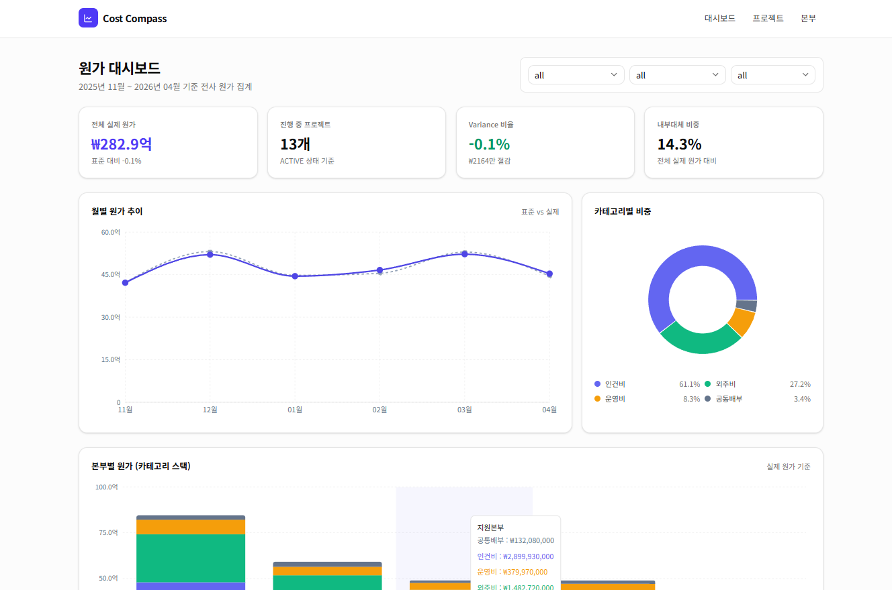
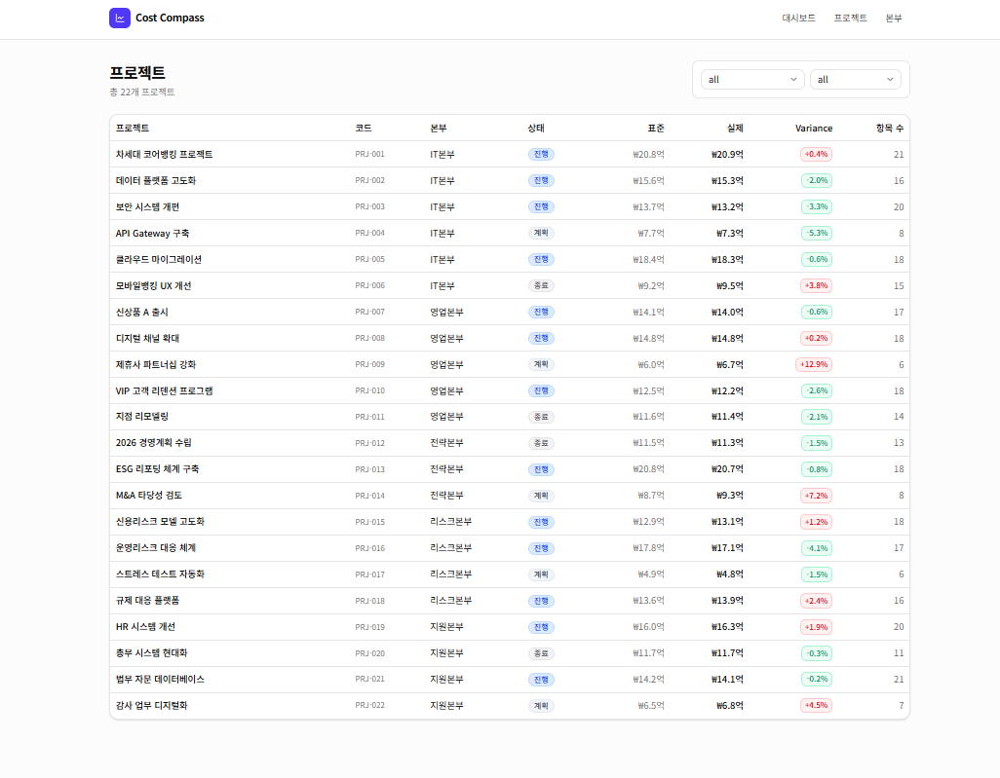
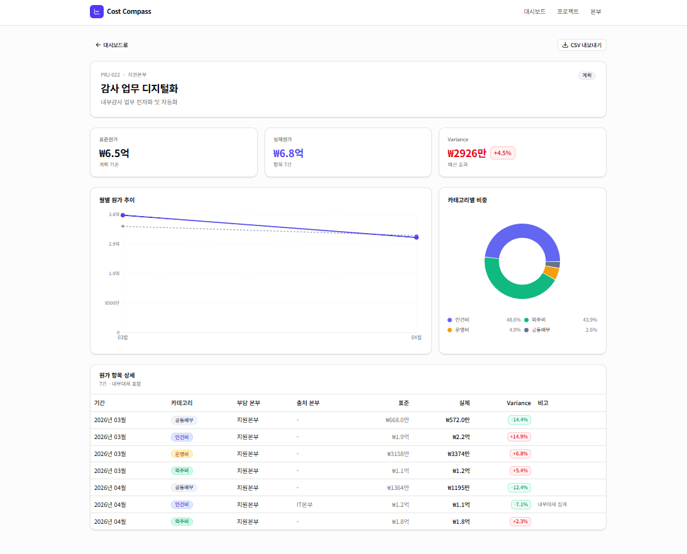

# Cost Compass

5개 본부 × 22개 프로젝트의 원가를 집계, 비교, 드릴다운하는 관리회계 대시보드.


> 노아에이티에스 2025년 상반기 연구소 인력 채용 포트폴리오 (주제 2) · [Interface Hub](https://github.com/dbwls99706/interface-hub)(주제 1)의 자매 프로젝트 · 개발 기간 반나절 · 바이브코딩(Claude Code 기반)

## 라이브 데모

- 데모: https://cost-compass.vercel.app
- 저장소: https://github.com/dbwls99706/cost-compass
- 자매 프로젝트: [Interface Hub](https://github.com/dbwls99706/interface-hub) (주제 1, 인터페이스 통합 관리 플랫폼)


*전사 KPI, 월별 추이, 카테고리 비중, 본부별 스택, 프로젝트 Top 10을 한 화면에 집계한다.*


*본부와 상태로 필터링하고 Variance 30% 초과 프로젝트는 행 배경으로 강조한다.*


*표준원가, 실제원가, Variance KPI와 카테고리 비중, 월별 추이, 원가 항목 상세를 드릴다운한다.*


*UTF-8 BOM 포함 CSV로 내보내 엑셀에서 한글 깨짐 없이 열린다.*

## 문제 정의와 해결

금융사는 5개 본부가 20여 개 프로젝트를 동시에 수행한다. 원가 데이터는 본부 시스템마다 분산돼 있고, 내부대체와 표준원가 배분까지 더해지면 관리자 관점의 통합 시야가 없다.

Cost Compass는 집계된 원가를 본부, 프로젝트, 카테고리, 월별로 드릴다운하는 조회 전용 대시보드다. 필터는 URL 쿼리스트링에 붙여 공유 가능한 링크로 저장되고, 차트 막대 클릭은 그대로 해당 프로젝트 상세로 이동한다.

## 핵심 기능

- 전사 KPI 카드 (전체 실제 원가, 진행 프로젝트 수, Variance 비율, 내부대체 비중)
- 5가지 차트 (월별 추이 Line, 카테고리 Pie, 본부별 Stacked Bar, 프로젝트 Top 10 Horizontal Bar, 최근 항목 Table)
- URL 기반 필터 공유 (기간, 본부, 상태)
- 프로젝트 드릴다운 (KPI + 차트 2종 + 원가 항목 상세)
- CSV 내보내기 (BOM 포함 UTF-8, 엑셀 한글 호환)
- 로컬 SQLite와 프로덕션 Turso libSQL을 코드 변경 없이 환경변수로 전환

## Interface Hub와 비교

| 항목 | Interface Hub | Cost Compass |
| --- | --- | --- |
| 성격 | 운영자 도구 (CRUD + 실행) | 분석 도구 (조회 + 드릴다운) |
| 주제 | 인터페이스 통합 관리 | 원가/관리회계 |
| 핵심 패턴 | Adapter 패턴, SWR 조건부 폴링 | JS 집계, Server Component 위주 |
| 차트 | 1종 (BarChart) | 5종 (Line, Pie, Stacked, Horizontal Bar, Table) |
| 개발 시간 | 1일 | 반나절 |

두 프로젝트는 동일한 기술 기반 위에서 서로 다른 문제 유형을 해결한다. Interface Hub는 "쓰는" 도구, Cost Compass는 "읽는" 도구다.

## 기술 스택

| 영역 | 기술 | 선택 이유 |
| --- | --- | --- |
| 프레임워크 | Next.js 16 App Router, React 19 | Server Component로 집계 쿼리를 서버에서 완결하고 클라이언트는 표시만 담당 |
| 언어 | TypeScript strict, Zod | any 금지 정책과 런타임 검증을 단일 스키마로 통합 |
| UI | Tailwind CSS, shadcn/ui (Base UI) | 디자인 시스템 일관성 |
| 차트 | Recharts 3 (Line, Pie, Stacked Bar, Horizontal Bar) | 동일 API로 5종 차트 구성 |
| ORM | Prisma 7 + libSQL driver adapter | 단일 스키마로 SQLite/libSQL 전환 |
| DB | SQLite(로컬), Turso libSQL(프로덕션) | 저비용 로컬 개발과 HTTP 기반 서버리스 배포 양립 |
| 배포 | Vercel | App Router와 Server Action 친화, 무중단 배포 |

## 데이터 모델

```
Division            본부 (id, name, headcount)
    1:N
Project             프로젝트 (id, code, name, divisionId, status)
    1:N
CostItem            원가 항목
                      projectId
                      divisionId             (부담 본부)
                      sourceDivisionId?      (내부대체 출처 본부)
                      category               (LABOR / OUTSOURCE / OPERATING / COMMON)
                      period                 (YYYY-MM)
                      standardAmount (Int)
                      actualAmount   (Int)
                      isInterUnit    (Bool)
```

- `Division.name`은 unique, `Project.code`는 unique (PRJ-001 형식)
- `CostItem`은 `divisionId`(부담 본부)와 `sourceDivisionId`(내부대체 출처 본부)로 본부와 이중 관계를 맺는다
- 금액은 전부 정수(원 단위)로 저장, 소수점 없음
- `period`는 `YYYY-MM` 문자열이라 정렬이 곧 시간순

## 아키텍처 개요

```
Browser
  │
  ▼
Next.js Server Component
  │  getDashboardStats / listProjects / getProjectDetail
  ▼
Server Action (lib/actions/cost-query.ts)
  │  prisma.costItem.findMany (필터 적용)
  ▼
JS 집계 (groupBy 없이 Map 기반)
  │
  ▼
Server Component → Client Chart (Recharts)
```

Prisma `groupBy`를 쓰지 않고 JS에서 집계하는 이유: SQLite + driver adapter 환경의 호환성 확보, 320여 건 규모에서 메모리와 CPU 부담 무시 가능. 대시보드 1회 요청이 DB 3회 호출로 끝나고, 집계 로직은 타입스크립트 함수 한 곳에 모인다.

## 확장 로드맵

- 원가 직접 입력 폼 (현재는 조회 전용)
- 표준원가 배분 규칙 엔진 (ABC 기반)
- 월 마감 / 확정 워크플로
- 본부 단위 권한 분리 (Row Level Security)
- Excel 정식 템플릿 내보내기 (xlsx, 셀 서식 포함)

## 개발 프로세스

### Claude Code와 협업한 바이브코딩

Interface Hub에서 정립한 바이브코딩 프로세스를 그대로 적용했다. 작업은 Phase 0부터 Phase 3까지 단계별로 쪼개고 각 Phase의 범위와 검증 기준을 먼저 글로 못박은 뒤 구현으로 들어갔다.

| Phase | 범위 | 핵심 결과물 |
| --- | --- | --- |
| 0 | 프로젝트 부트스트랩 | Next.js 16 + Tailwind + shadcn 초기화 |
| 1 | DB 스키마와 Prisma 셋업 | Division/Project/CostItem 모델, 시드 326건, 집계 헬퍼 |
| 2 | 대시보드와 프로젝트 화면 | KPI 4종, 차트 5종, 프로젝트 목록/상세, CSV 내보내기 |
| 3 | README와 Vercel 배포 준비 | Turso 연동, postinstall 훅, serverExternalPackages, vercel.json |

`CLAUDE.md`에는 Interface Hub 개발 중 겪은 이슈를 선제 반영해 같은 시행착오를 두 번 겪지 않도록 했다.

- Prisma 7 모델 타입명이 `Division`이 아니라 `DivisionModel`인 점
- `schema.prisma`의 `datasource.url` 제약 (Prisma 7에서 deprecated, `prisma.config.ts`로 이동)
- Recharts `ResponsiveContainer`에 `minWidth={0} minHeight={0}`을 붙여 측정 race 방지
- shadcn `Select`는 react-hook-form과 쓸 때 `Controller`로 감싸야 함
- `file:./dev.db`와 `libsql://...?authToken=...` 양쪽을 단일 함수로 파싱

Interface Hub에서 쌓은 레슨 덕분에 Phase 1 DB 셋업부터 Phase 2 대시보드까지 3~4시간 내 완료 가능한 속도를 확보했다.

## 로컬 실행

```bash
git clone https://github.com/dbwls99706/cost-compass.git
cd cost-compass
npm install
npx prisma migrate dev --name init
npx prisma db seed
npm run dev
```

브라우저에서 http://localhost:3000 접속.

`.env`에 `DATABASE_URL="file:./dev.db"`만 있으면 동작한다.

## 프로덕션 배포

1. Turso 데이터베이스 생성: `turso db create cost-compass`
2. URL과 토큰 조회: `turso db show cost-compass --url`, `turso db tokens create cost-compass`
3. 마이그레이션 적용: `DATABASE_URL='libsql://...?authToken=...' npm run db:deploy`
4. 시드 적용(선택): `DATABASE_URL='libsql://...?authToken=...' npm run db:seed:remote`
5. Vercel 프로젝트 import 후 환경변수 등록
   - `TURSO_DATABASE_URL` = `libsql://...turso.io`
   - `TURSO_AUTH_TOKEN` = `eyJ...`
6. Deploy 클릭

Prisma CLI는 `libsql://` URL을 직접 이해하지 못하기 때문에 원격 마이그레이션은 `scripts/turso-deploy.ts`가 `_applied_migrations` 테이블로 멱등성을 확보한 뒤 SQL을 순차 실행한다. `postinstall`과 `prebuild`에 걸린 `prisma generate`는 Vercel 빌드 시 클라이언트를 자동 생성하고, `next.config.ts`의 `serverExternalPackages`에 `@prisma/client`, `@prisma/adapter-libsql`, `@libsql/client`를 등록해 서버리스 번들 문제를 차단했다.

## 프로젝트 구조

```
app/                       Next.js App Router 페이지
  page.tsx                 대시보드 (KPI, 차트 5종, 최근 항목)
  projects/
    page.tsx               프로젝트 목록
    [id]/page.tsx          프로젝트 상세
    [id]/not-found.tsx
components/
  dashboard/               KpiCard, FilterBar, 차트, Badge, ExportCsvButton
  ui/                      shadcn/ui 컴포넌트
lib/
  actions/
    cost-query.ts          대시보드, 목록, 상세 집계 Server Actions
    export.ts              CSV 내보내기 Server Action
  prisma.ts                PrismaLibSql adapter + 환경 자동 감지
  types/db.ts              enum, 라벨, 포맷터, Variance 계산
prisma/
  schema.prisma            Division, Project, CostItem
  seed.ts                  5본부, 22프로젝트, 326 원가 항목
  migrations/
scripts/
  turso-deploy.ts          Turso 원격 마이그레이션 적용 스크립트
  turso-reset.ts           _applied_migrations 초기화 스크립트
docs/screenshots/          README용 스크린샷
```
